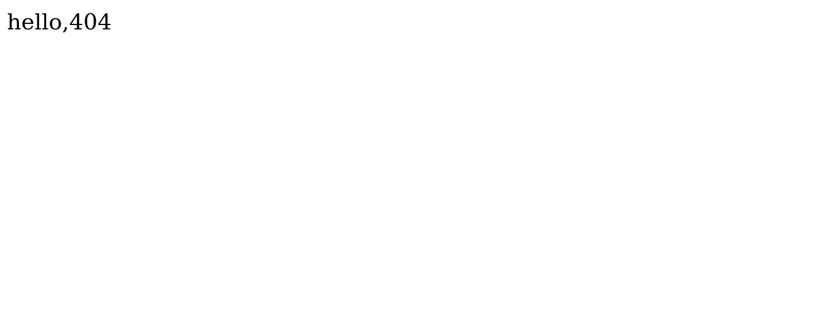

# Nginx path tutorial

nginxの設定ファイルではlocationディレクティブでURIのパスごとの設定を記述することができる。

```

location / {
	(this is context of location)
}

```

nginxはこのlocationディレクティブに記載されたコンテキストを元にパスのルーティングをおこなう。

(ルーティング=>どのURLにしたがって、どのパスからファイルを返すのか？どのURLにしたがって、他のホストにプロキシするのか？など)

ユーザーからのリクエストURIパスがパス条件に一致したときにコンテキストが適用される。

# Prefix

locationのプレフィックスを指定することにより、locationのパス名にさまざまな意味をもたせることができる。

nginxでは全部で、5つのプレフィックスが用意されている。


* **=** 	: 完全一致。設定したパスとリクエストURIが一言一句一致したときだけ。
* NoPrefix 	: 前方一致
* **^~** 	: 前方一致。一致した場合、正規表現の評価を行わない。
* **~**		: 正規表現(大文字・小文字を区別する)
* **~\***	: 正規表現(大文字・小文字を区別しない)

複数のlocationが設定されている場合は、リクエストURIを評価して選出されたコンテキストが適用される。

その評価基準が...

**1. 前方一致の条件(完全一致も)とリクエストURIが一致するかを評価。**

  すべてのlocationディレクティブの中から、最長一致のlocationを選出。その選ばれたものによって、	　　さらに処理が異なる。

  * =(完全一致): すぐにこのコンテキストが適用。
  
  * ^~(前方一致): すぐにこのコンテキストが適用。
  
  * その他( ,~,~\*): つぎの処理に進む。

**2. 正規表現の条件とリクエストURIが一致するかを評価。**

  定義されているlocationディレクティブの条件の順に、リクエストURIとlocationの正規表現の一致を評価する。
	一致していた場合、すぐにそのlocationディレクティブのコンテキストを適用する。

**3. 前方一致(プレフィックスの定義なし)**

**4. 404エラーを返す**


# Example

実際にリクエストURIによって、Nginxのどのlocationディレクティブが適用されるのかをみていく。

今回使用する、nginxサーバーのファイル構成

```

/usr/share/nginx

|
|------ html
|	|
|	|------ 404.html
|	|
|	|------ index.html
|	|
|	|------ 50x.html
|
|------ equalA
|	|
|	|------ equal.html
|
|------ nothing
	|
	|------ nothing.html


```

※ ポートは80番、ホストはlocalhost

## ルートの重複

* nginxの設定

```

location = / {
	root /usr/share/nginx/equal;
	index equal.html;
}

location / {
	root /usr/share/nginx/nothing;
}


```

* リクエストURL

```

http://localhost:80/

```

この場合、一見/usr/share/nginx/equal/equal.htmlを返すように見えるが、答えは**404 Error**。



理由は、まずリクエストURIの評価はプレフィックス規則にしたがって、**location = / \{**が適用される。

そして、rootの/usr/share/nginx/equalがルートになりますが、indexディレクティブにより内部リダイレクトが発生。 リクエストURIが**/equal.html**に変換され、再び評価される。すると、今度は**location / \{**が適用される。

そしてrootの/usr/share/nginx/nothingがルートになりますが、そこにはequal.htmlがないので**404Error**が返される。

ちなみに、location = / \{ でindexにnothing.htmlを指定していたとしても、rootディレクティブにより禁止閲覧により**403 Forbidden**が返される。
